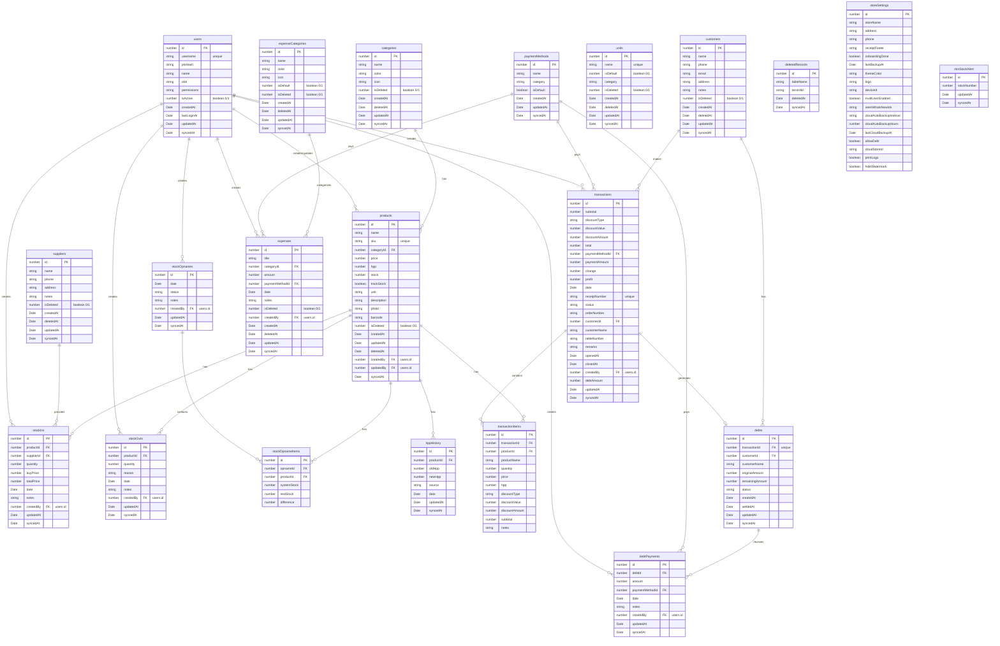

# Database Schema Reference

This is a Mermaid ER diagram representing the current IndexedDB schema (Version 15) defined in `src/lib/db.ts`.

```mermaid
erDiagram
    users {
        number id PK
        string username "unique"
        string pinHash
        string name
        string role
        string permissions
        number isActive "boolean 0/1"
        Date createdAt
        Date lastLoginAt
        Date updatedAt
        Date syncedAt
    }

    categories {
        number id PK
        string name
        string color
        string icon
        number isDeleted "boolean 0/1"
        Date createdAt
        Date deletedAt
        Date updatedAt
        Date syncedAt
    }

    products {
        number id PK
        string name
        string sku "unique"
        number categoryId FK
        number price
        number hpp
        number stock
        boolean trackStock
        string unit
        string description
        string photo
        string barcode
        number isDeleted "boolean 0/1"
        Date createdAt
        Date updatedAt
        Date deletedAt
        number createdBy FK "users.id"
        number updatedBy FK "users.id"
        Date syncedAt
    }

    suppliers {
        number id PK
        string name
        string phone
        string address
        string notes
        number isDeleted "boolean 0/1"
        Date createdAt
        Date deletedAt
        Date updatedAt
        Date syncedAt
    }

    customers {
        number id PK
        string name
        string phone
        string email
        string address
        string notes
        number isDeleted "boolean 0/1"
        Date createdAt
        Date deletedAt
        Date updatedAt
        Date syncedAt
    }

    stockIns {
        number id PK
        number productId FK
        number supplierId FK
        number quantity
        number buyPrice
        number totalPrice
        Date date
        string notes
        number createdBy FK "users.id"
        Date updatedAt
        Date syncedAt
    }

    stockOuts {
        number id PK
        number productId FK
        number quantity
        string reason
        Date date
        string notes
        number createdBy FK "users.id"
        Date updatedAt
        Date syncedAt
    }

    stockOpnames {
        number id PK
        Date date
        string status
        string notes
        number createdBy FK "users.id"
        Date updatedAt
        Date syncedAt
    }

    stockOpnameItems {
        number id PK
        number opnameId FK
        number productId FK
        number systemStock
        number realStock
        number difference
    }

    hppHistory {
        number id PK
        number productId FK
        number oldHpp
        number newHpp
        string source
        Date date
        Date updatedAt
        Date syncedAt
    }

    paymentMethods {
        number id PK
        string name
        string category
        boolean isDefault
        Date createdAt
        Date updatedAt
        Date syncedAt
    }

    transactions {
        number id PK
        number subtotal
        string discountType
        number discountValue
        number discountAmount
        number total
        number paymentMethodId FK
        number paymentAmount
        number change
        number profit
        Date date
        string receiptNumber "unique"
        string status
        string orderNumber
        number customerId FK
        string customerName
        string tableNumber
        string remarks
        Date openedAt
        Date closedAt
        number createdBy FK "users.id"
        number debtAmount
        Date updatedAt
        Date syncedAt
    }

    transactionItems {
        number id PK
        number transactionId FK
        number productId FK
        string productName
        number quantity
        number price
        number hpp
        string discountType
        number discountValue
        number discountAmount
        number subtotal
        string notes
    }

    units {
        number id PK
        string name "unique"
        number isDefault "boolean 0/1"
        string category
        number isDeleted "boolean 0/1"
        Date createdAt
        Date deletedAt
        Date updatedAt
        Date syncedAt
    }

    expenseCategories {
        number id PK
        string name
        string color
        string icon
        number isDefault "boolean 0/1"
        number isDeleted "boolean 0/1"
        Date createdAt
        Date deletedAt
        Date updatedAt
        Date syncedAt
    }

    expenses {
        number id PK
        string title
        number categoryId FK
        number amount
        number paymentMethodId FK
        Date date
        string notes
        number isDeleted "boolean 0/1"
        number createdBy FK "users.id"
        Date createdAt
        Date deletedAt
        Date updatedAt
        Date syncedAt
    }

    debts {
        number id PK
        number transactionId FK "unique"
        number customerId FK
        string customerName
        number originalAmount
        number remainingAmount
        string status
        Date createdAt
        Date settledAt
        Date updatedAt
        Date syncedAt
    }

    debtPayments {
        number id PK
        number debtId FK
        number amount
        number paymentMethodId FK
        Date date
        string notes
        number createdBy FK "users.id"
        Date updatedAt
        Date syncedAt
    }

    deletedRecords {
        number id PK
        string tableName
        string recordId
        Date deletedAt
        Date syncedAt
    }

    storeSettings {
        number id PK
        string storeName
        string address
        string phone
        string receiptFooter
        boolean onboardingDone
        Date lastBackupAt
        string themeColor
        string logo
        string deviceId
        boolean multiUserEnabled
        string seenWhatsNewIds
        string cloudAutoBackupInterval
        number cloudAutoBackupHours
        Date lastCloudBackupAt
        boolean allowDebt
        string cloudStoreId
        boolean printLogo
        boolean hideWatermark
    }

    minStockAlert {
        number id PK
        number stockNumber
        Date updatedAt
        Date syncedAt
    }

    categories ||--o{ products : "has"
    products ||--o{ stockIns : "has"
    products ||--o{ stockOuts : "has"
    products ||--o{ hppHistory : "has"
    products ||--o{ transactionItems : "has"
    products ||--o{ stockOpnameItems : "has"
    suppliers ||--o{ stockIns : "provides"
    customers ||--o{ transactions : "makes"
    customers ||--o{ debts : "has"
    transactions ||--o{ transactionItems : "contains"
    transactions ||--o| debts : "generates"
    debts ||--o{ debtPayments : "receives"
    expenseCategories ||--o{ expenses : "categorizes"
    paymentMethods ||--o{ transactions : "pays"
    paymentMethods ||--o{ expenses : "pays"
    paymentMethods ||--o{ debtPayments : "pays"
    stockOpnames ||--o{ stockOpnameItems : "contains"
    users ||--o{ transactions : "creates"
    users ||--o{ stockIns : "creates"
    users ||--o{ stockOuts : "creates"
    users ||--o{ expenses : "creates"
    users ||--o{ debtPayments : "creates"
    users ||--o{ stockOpnames : "creates"
    users ||--o{ products : "creates/updates"
```
